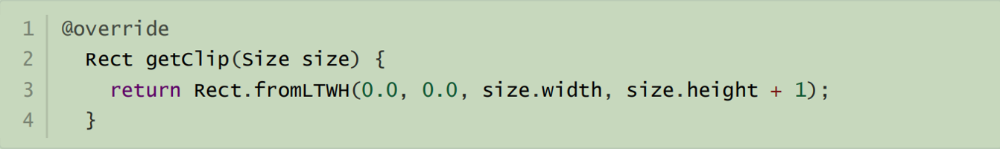
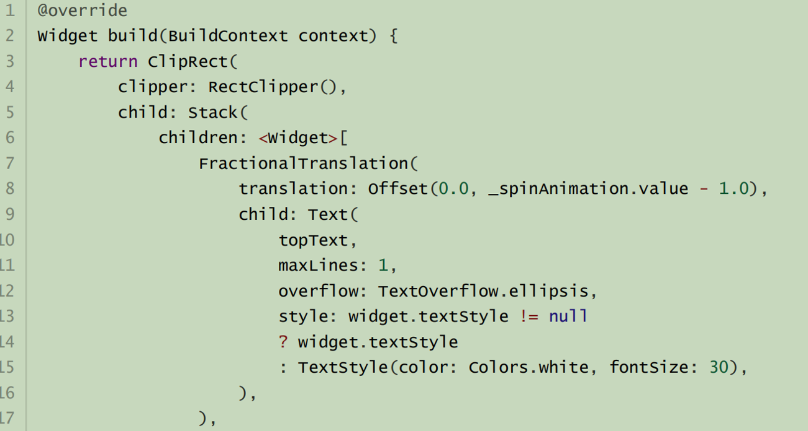
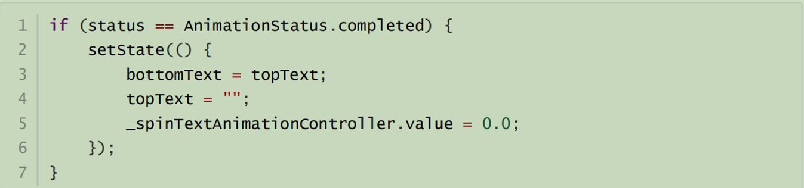
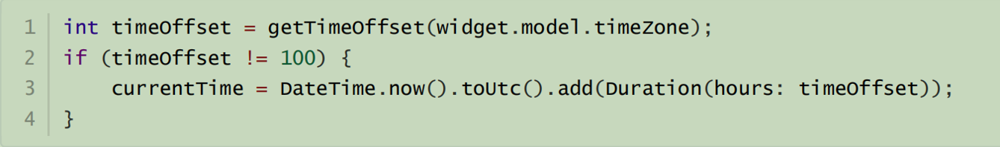
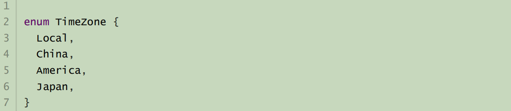
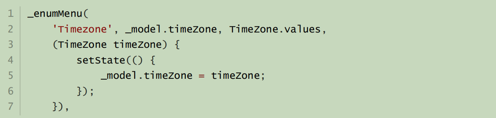

# 玩转客户端-第八组

## Flutter时钟挑战

- **团队介绍**

- **项目背景和分析思路**

- **项目原理和成果**

- **结论和反思**


## Part01- 团队介绍

组长：宗晨 四川大学2017级本科生 负责：数字滑动，时区切换

组员：陈杰 四川大学2017级本科生 负责：机械时钟，天气展示 

组员：刘君昊 四川大学2019级本科生 负责：项目汇总，路由管理


## Part02-项目背景和分析思路


### 1.背景

本项目使用基于flutter制作了一个时钟APP，其功能除了基础的数字时钟与机械时钟的显示，还有

- 1.天气显示

- 2.时区切换

- 3.动画效果

三个进阶功能


### 2.设计思路

实现基础功能我们采用了两种方式，数字时钟和机械时钟，并提供滑动操作让用户可以在二者切换。此外，每隔一段时间获取天气，并更新至model，并且提供UI界面让用户更改时区。


## Part03-项目原理和成果

### 1.路由管理

路由管理，就是管理页面之间如何跳转，通常也可被称为导航管理。Flutter中的路由管理和原生开发类似，无论是Android还是iOS，导航管理都会维护一个路由栈，路由入栈(push)操作对应打开一个新页面，路由出栈(pop)操作对应页面关闭操作，而路由管理主要是指如何来管理路由栈。本闹钟实现数字时钟和机械时钟的转换，新路由界面即为机械时钟界面。数字时钟由Statefulwidget和其state两部分组成，其中state部分承担了闹钟界面的绘制。

Navigator是一个路由管理的组件，它提供了打开和退出路由页方法。Navigator通过一个栈来管理活动路由集合。通常当前屏幕显示的页面就是栈顶的路由。
采用匿名路由的方法：两个常用方法

- Future push(BuildContext context, Route route)
  将给定的路由入栈（即打开新的页面），返回值是一个Future对象，用以接收新路由出栈（即关闭）时的返回数据。
- bool pop(BuildContext context, [ result ])
  将栈顶路由出栈，result为页面关闭时返回给上一个页面的数据。


### 2.数字滑动切换显示功能

绘制上下两个数字，但只显示一个，使用CustomClipper来实现 。代码如下:



动画最开始时，下面的数字显示出来，两个数字一起向下移动，移动过程中，上面的数字逐渐显示出来，然后下面的数字逐渐被挡住，移动到了最下面的时候，上面的数字完全显示出来了，此时动画也结束了。代码如下:




动画结束的时候，下面的数字设为上面的数字，上面的数字设为新的要显示的数字，把动画的value设 为零，重新开始动画.代码如下:



在获取时间的时候先把时间转换为UTC标准时间，然后通过选择的时区对应的时差对时间进行修正。代码如下:



时区的选择，通过在model里添加时区的枚举值，并暴露出一个方法以供将时区枚举值转换成时差。代码如下:



再在costomlize中添加相应的选项。代码如下: 




### 3.机械时钟

机械时钟分为两个部分，一个是动画背景，一个是在动画背景的基础上绘制表盘和指针。

#### （1) 动画背景

此部分是借助simple_animations库来实现一个渐变波形的背景动画。

- 渐变效果

在Flutter 中内置的 BoxDecoration 使用 LinearGradient 来实现渐变，在这里定义两个的 Track的颜色 color1 和 color2，并将它设置到 ControlledAnimation 中，最后在 LinearGradient 使用 这两个颜色，这样就实现了简单的渐变效果。

- 波形动画

三个波型相互重叠的效果，确保它们彼此独立，最后产生波纹的叠加效果。这是三个波型相互重叠的效果，确保它们彼此独立，最后产生波纹的叠加效果。

- speed：控制波浪动画的持续时间；

- height ：设置波浪作用的区域；

- offset： x轴的偏移，以给出不同的波形“起始位置”； 

首先我们需要为动画设置一个 0.0 到 2 * pi 之间的值，并将该值放入到正弦函数中，接着我们在三个位置上采样 y 的数值大小：左侧、中间和末端。这样从左到右就覆盖了一个 pi 大小的间隔，这样始终可以看到一个完整的正弦波的一半，最后利用了 Flutter 的 Canvas 路径绘制的方法绘制出一个 Path 。

```Dart
class AnimatedWave extends StatelessWidget {
  final double height;//控制波浪动画的持续时间；
  final double speed;//设置波浪作用的区域
  final double offset;//x轴的偏移，以给出不同的波形“起始位置”

  AnimatedWave({this.height, this.speed, this.offset = 0.0});

  @override
  Widget build(BuildContext context) {
    return LayoutBuilder(builder: (context, constraints) {
      return Container(
        height: height,
        width: constraints.biggest.width,
        child: ControlledAnimation(
            playback: Playback.LOOP,
            duration: Duration(milliseconds: (5000 / speed).round()),
            tween: Tween(begin: 0.0, end: 2 * pi),
            builder: (context, value) {
              return CustomPaint(
                foregroundPainter: CurvePainter(value + offset),
              );
            }),
      );
    });
  }
}

class CurvePainter extends CustomPainter {
  final double value;

  CurvePainter(this.value);

  @override
  void paint(Canvas canvas, Size size) {
    final white = Paint()..color = Colors.white.withAlpha(60);
    final path = Path();

    final y1 = sin(value);//三角函数，设置0-0.2pi值
    final y2 = sin(value + pi / 2);
    final y3 = sin(value + pi);

    final startPointY = size.height * (0.5 + 0.4 * y1);
    final controlPointY = size.height * (0.5 + 0.4 * y2);
    final endPointY = size.height * (0.5 + 0.4 * y3);

    path.moveTo(size.width * 0, startPointY);
    path.quadraticBezierTo(
        size.width * 0.5, controlPointY, size.width, endPointY);
    path.lineTo(size.width, size.height);
    path.lineTo(0, size.height);
    path.close();
    canvas.drawPath(path, white);
  }

  @override
  bool shouldRepaint(CustomPainter oldDelegate) {
    return true;
  }
}

```
最后使用stack将控件堆叠在一起即可。

#### (2) 机械时钟表盘及指针

在CustomPainter上直接绘制时钟，具体的讲解在代码注释中

```dart
class CustomTimeClock extends CustomPainter {
  //外大圆
  //画笔
  Paint _outerCirclePaint = Paint() //初始化外层圆参数
    ..style = PaintingStyle.stroke //fill填充，stroke空心
    ..isAntiAlias = true //是否启动抗锯齿
    ..color = Colors.yellow //画笔的颜色，深橘色
    ..strokeWidth = 4; //线的宽度

  //粗刻度线
  Paint _linePaint = Paint()
    ..style = PaintingStyle.fill
    ..isAntiAlias = true
    ..color = Colors.yellow
    ..strokeWidth = 4;

  //圆心
  Offset _centerOffset = Offset(0, 0);

  //圆半径
  double _bigCircleRadius =
     min(Screen.screenHeightDp / 3,  Screen.screenWidthDp / 3);

  final int lineHeight = 10;

  //文字画笔
  TextPainter _textPainter = new TextPainter(
      textAlign: TextAlign.left, textDirection: TextDirection.rtl);

  @override
  void paint(Canvas canvas, Size size) {
    //print('_bigCircleRadius: ${_bigCircleRadius}');
    //绘制大圆
    canvas.drawCircle(_centerOffset, _bigCircleRadius, _outerCirclePaint);
    //绘制圆心
    _outerCirclePaint.style = PaintingStyle.fill;
    canvas.drawCircle(_centerOffset, _bigCircleRadius / 20, _outerCirclePaint);

    /**
     * 绘制刻度,秒针转一圈需要跳60下,
     * 这里只画6点整的刻度线，
     * 但是由于每画一条刻度线之后，
     * 画布都会旋转60°(转为弧度2*pi/60),
     * 所以画出60条刻度线
     */
    for (int i = 0; i < 60; i++) {
      _linePaint.strokeWidth = i % 5 == 0 ? (i % 3 == 0 ? 10 : 4) : 1; //设置线的粗细
      canvas.drawLine(Offset(0, _bigCircleRadius - lineHeight),
          Offset(0, _bigCircleRadius), _linePaint);
      canvas.rotate(pi / 30); //2 * pi / 60
    }
    //绘制数字,
    for (int i = 0; i < 12; i++) {
      canvas.save(); //与restore配合使用保存当前画布
      canvas.translate(
          0.0, -_bigCircleRadius + 30); //平移画布画点于时钟的12点位置，+30为了调整数字与刻度的间隔
      _textPainter.text = TextSpan(
          style: new TextStyle(color: Colors.yellow, fontSize: 22),
          text: i.toString());
      canvas.rotate(-deg2Rad(30) * i); //保持画数字的时候竖直显示。
      _textPainter.layout();
      _textPainter.paint(
          canvas, Offset(-_textPainter.width / 2, -_textPainter.height / 2));
      canvas.restore(); //画布重置,恢复到控件中心
      canvas.rotate(deg2Rad(30)); //画布旋转一个小时的刻度，把数字和刻度对应起来
    }

    //绘制指针
    int hours = DateTime.now().hour;
    int minutes = DateTime.now().minute;
    int seconds = DateTime.now().second;
    //print("时: ${hours} 分：${minutes} 秒: ${seconds}");
    //时针角度//以下都是以12点为0°参照
    //12小时转360°所以一小时30°
    double hoursAngle =
        (minutes / 60 + hours - 12) * pi / 6; //把分钟转小时之后*（2*pi/360*30）
    //分针走过的角度,同理,一分钟6°
    double minutesAngle = (minutes + seconds / 60) * pi / 30; //(2*pi/360*6)
    //秒针走过的角度,同理,一秒钟6°
    double secondsAngle = seconds * pi / 30;
    //画时针
    _linePaint.strokeWidth = 4;
    canvas.rotate(hoursAngle);
    canvas.drawLine(
        Offset(0, 0), new Offset(0, -_bigCircleRadius + 80), _linePaint);
    //画分针
    _linePaint.strokeWidth = 2;
    canvas.rotate(-hoursAngle); //先把之前画时针的角度还原。
    canvas.rotate(minutesAngle);
    canvas.drawLine(
        Offset(0, 0), new Offset(0, -_bigCircleRadius + 60), _linePaint);
    //画秒针
    _linePaint.strokeWidth = 1;
    canvas.rotate(-minutesAngle);
    canvas.rotate(secondsAngle);
    canvas.drawLine(
        Offset(0, 0), new Offset(0, -_bigCircleRadius + 30), _linePaint);
  }

  @override
  bool shouldRepaint(CustomPainter oldDelegate) {
    return true;
  }

  static TextPainter _getTextPainter(String msg) {
    return new TextPainter(
        text: TextSpan(
            style: new TextStyle(color: Colors.yellow, fontSize: 22),
            text: msg),
        textAlign: TextAlign.center,
        textDirection: TextDirection.ltr);
  }

  //角度转弧度
  num deg2Rad(num deg) => deg * (pi / 180.0);
}

```

### 4.获取实时天气

通过http请求获取天气数据，将得到的数据通过一个封装好的类解析成可显示的String，通过构建view，显示数据

这里用到了异步请求数据，数据来源：和风API

```dart

//以下是天气函数
  Future<WeatherData> _getWeather() async {
    return await _fetchWeather();
  }

//获取气象数据
  Future<WeatherData> _fetchWeather() async {
    final response = await http.get(
        'https://free-api.heweather.com/s6/weather/now?location=' +
            this.cityName +
            '&key=3c78f4b0812141b68d213ca3a7b17f97');
    if (response.statusCode == 200) {
      WeatherData data = WeatherData.fromJson(json.decode(response.body));
      return data;
    } else {
      return WeatherData.empty();
    }
  }
```

既然获取天气的异步方法返回的是Future对象，在渲染界面的时候即采用FutureBuilder构建widget，来保证正确请求到了数据。

```dart 
          Positioned.fill(
              child: FutureBuilder<WeatherData>(
            future: _getWeather(),
            builder: (context, snapshot) {
              if (snapshot.data != null)
                return Container(
                  width: double.infinity,
                  margin: EdgeInsets.only(top: 40.0),
                  child: Column(
                    children: <Widget>[
                      Text(cityName,
                          style: new TextStyle(
                              color: Colors.orange, fontSize: 40.0)),
                      Text(snapshot.data?.tmp,
                          style: new TextStyle(
                              color: Colors.orange, fontSize: 50.0)),
                      Text(snapshot.data?.cond,
                          style: new TextStyle(
                              color: Colors.orange, fontSize: 38.0)),
                      Text(
                        snapshot.data?.hum,
                        style:
                            new TextStyle(color: Colors.orange, fontSize: 25.0),
                      ),
                    ],
                  ),
                );
              else
                return Text('');
            },
          ))
```


## Part04-结论和反思

**1.了解了Dart语言的特性与基本用法**
	Dart中万物皆对象，而作为一门现代编程语言，函数式编程以及拉姆达的应用，提高了开发速度
而异步编程Future对象的应用使得Dart在IO以及网络请求着种耗时操作方面的性能也不错。


**2.flutter基本开发以及框架的了解**
	flutter中，所有的UI元素都是通过widget来控制的，调整UI即构建一个个的widget
flutter框架跨平台、高性能
Flutter使用Skia作为其2D渲染引擎Skia是跨平台的，并且底层用c++引擎是实现跨平台。而高性能得实现得益于Dart可以是AOT(Ahead of time)即“提前编译”。


**3.Flutter令人困惑的地方**

​	可能主要就在于它的数据和样式的耦合，自己之前是在学前端的，flutter的布局虽然看上去和前端挺像但是实际上写起来相差太大了，flutter的布局是在dart里层层嵌套出来的，很容易看错，并且flutter里面各种东西都是一个widget，一些样式，比如textStyle这样的在flutter中也是一个widget，如果可以把只能不同的widget加以区分，并且更加明确他们的规则，比如某一种widget一定要在另一个widget上等等，编程体验可能会有所提升。


**4.Flutter框架是跨平台开发并且具有高性能的**

​	在未来的开发市场有很大的优势。同时热重载也能及时修改并且查看，很方便。Dart的语法布局需要一段时间的理解才能看懂，嵌套的比较复杂。Flutter开发APP的过程结束了，自己在之前没有开发经验，但也感觉自己在其中收获了很多，不仅学习到客户端开发的基础知识，也锻炼了团队合作能力和交流能力。同时，也学会了去网上查阅资料，自我学习。


